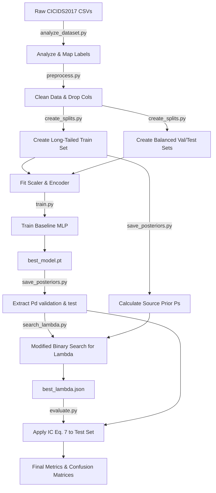

# PROJECT_DEEP_EXPLANATION

## SECTION 1 — EXECUTIVE SUMMARY

### The Problem
In many real-world machine learning applications, datasets are severely imbalanced. This means that certain classes (the "majority classes") have vastly more examples than others (the "minority classes"). Deep neural networks trained on such data tend to develop a strong bias toward the majority classes. During inference, if the real-world data distribution (target distribution) differs from the training distribution (source distribution), the model's performance degrades significantly, particularly on the minority classes. 

### Why Intrusion Detection?
Network intrusion detection is a classic example of this problem. Over 99% of network traffic in a standard environment is benign. Malicious traffic (like a Botnet or a Web Attack) represents a tiny fraction of the data. If a model predicts "Benign" for everything, it achieves 99% accuracy but fails its primary objective: detecting attacks. The **CICIDS2017** dataset perfectly captures this reality, containing millions of benign flows but very few instances of specific attacks.

### The Proposed Solution
The project reproduces the core methodology of the NeurIPS 2020 paper: *"Posterior Re-calibration for Imbalanced Datasets"*. The paper proposes a post-hoc calibration technique called **Imbalance Calibration (IC)**. Instead of modifying the training process (e.g., using focal loss, oversampling, or custom architectures), IC adjusts the model's output probabilities (*posteriors*) after training. It shifts the decision boundary mathematically to compensate for the imbalance seen during training.

### What This Project Reproduces
This project builds an end-to-end pipeline that:
1. Processes the raw CICIDS2017 dataset.
2. Artificially induces a severe long-tailed imbalance in the training set to simulate worst-case scenarios.
3. Keeps the validation and test sets perfectly balanced to simulate a uniform target distribution.
4. Trains a standard Multi-Layer Perceptron (MLP) on the imbalanced data.
5. Applies the IC method from the paper to correct the model's posteriors.
6. Implements the paper's modified binary search algorithm to find the optimal calibration parameter ($\lambda$).
7. Evaluates the dramatic improvement in minority class recall without retraining the model.

---

## SECTION 2 — RESEARCH PAPER EXPLANATION

### Distribution Shift
Machine learning models usually assume that the training data and the test data are drawn from the same underlying distribution (i.i.d. assumption). When this is violated, we experience a **Distribution Shift**.

*   **Prior Shift (Label Shift):** The marginal distribution of the labels $P(y)$ changes between training and testing, but the conditional distribution of features given the label $P(x|y)$ remains the same. This means the *frequency* of an attack might change, but what the attack *looks like* does not. This is the exact problem this paper tackles.
*   **Covariate Shift:** The distribution of features $P(x)$ changes, but the conditional distribution $P(y|x)$ remains the same. (e.g., Network traffic speeds increase overall, but attack signatures are identical).

### Class Imbalance Problem
*   **Majority Class:** The class with the highest frequency (e.g., BENIGN).
*   **Minority Class:** The class with the lowest frequency (e.g., Bot).
*   **Long-Tailed Distributions:** When plotted, the class frequencies drop off sharply, forming a long tail. Neural networks trained on long-tailed data optimize total loss, which is dominated by majority samples. They learn to predict the majority prior as a "safe guess," ignoring subtle features of minority classes.

### Core Idea of the Paper
The paper aims to correct **Label-Prior Shift**.

#### Bayes Classifier
A model estimates the discriminative posterior $P_d(y|x)$, which is the probability of class $y$ given features $x$. By Bayes' Theorem:
$P(y|x) = \frac{P(x|y)P(y)}{P(x)}$

#### Prior Rebalancing
If we know the model was trained on a source prior $P_s(y)$ but will be tested on a target prior $P_t(y)$, we can "swap out" the prior mathematically. We define the Rebalanced Posterior $P_r(y|x)$ as:

$P_r(y|x) \propto P_d(y|x) \cdot \frac{P_t(y)}{P_s(y)}$

Here:
*   $P_s(y)$ is the frequency of class $y$ in the training set.
*   $P_t(y)$ is the frequency of class $y$ in the test set (which we assume is uniform, i.e., $1/K$ for $K$ classes).

#### Imbalance Calibration (IC)
The paper argues that simple Prior Rebalancing is mathematically sound but practically flawed because neural networks are poorly calibrated (they are overconfident). Rebalancing an overconfident model pushes the decision boundaries too far or not far enough.
To fix this, the authors introduce a hyperparameter $\lambda$ to interpolate between the original model output and the theoretically rebalanced output. They minimize the Kullback-Leibler (KL) divergence to find a final posterior $P_f$.

**Equation 6 (Optimization):**
$P_f = \text{argmin}_{P} [ (1-\lambda) KL(P || P_d) + \lambda KL(P || P_r) ]$

**Equation 7 (Closed-form Calibrated Posterior):**
$P_f(y|x) \propto P_d(y|x)^{1-\lambda} \cdot P_r(y|x)^\lambda$

#### The Lambda ($\lambda$) Parameter
*   **$\lambda = 0$:** Standard model, no calibration.
*   **$\lambda = 1$:** Pure Prior Rebalancing (strict Bayesian update).
*   **$\lambda > 1$:** Aggressive rebalancing. Required when the neural network is severely overconfident in its majority class predictions.

### Search for $\lambda$
Because $\lambda$ is a continuous value, finding the optimal $\lambda$ requires searching. The paper proves that model performance is generally a **concave function** with respect to $\lambda$. Therefore, instead of a slow grid search, we can use a modified binary search (or ternary search) on a validation set to find the optimal $\lambda$ in $O(\log N)$ time.

---

## SECTION 3 — REPRODUCTION STRATEGY

The original paper evaluated IC on image datasets (CIFAR-100, ImageNet). We reproduce the methodology on a **tabular intrusion detection dataset** to demonstrate that IC is architecture-agnostic and highly applicable to cybersecurity.

| Paper Concept | Project Implementation |
| :--- | :--- |
| Image classification task | Network traffic classification (CICIDS2017) |
| ResNet Architecture | Multi-Layer Perceptron (MLP) |
| Long-Tailed CIFAR-100 | Artificially sampled Long-Tailed CICIDS2017 |
| Source Prior $P_s(y)$ | Calculated from Long-Tailed train split counts |
| Target Prior $P_t(y)$ | Uniform ($1/7$) because Val/Test are balanced |
| Equation 7 Calibration | Implemented in `imbalance_calibration.py` |
| Algorithm 2 ($\lambda$ search) | Implemented in `search_lambda.py` |

---

## SECTION 4 — PROJECT ARCHITECTURE



---

## SECTION 5 — DATASET ANALYSIS

**Dataset:** CICIDS2017 (Canadian Institute for Cybersecurity). It contains benign traffic and common attacks like DoS, DDoS, Brute Force, XSS, and Botnets.
**Features:** 78 numeric features representing network flow statistics (e.g., Packet Length, Flow Duration). We drop identifiers like IP/Port/Timestamp to ensure the model learns traffic behavior, not memorized IPs.

**Imbalance Strategy:**
The original dataset has millions of BENIGN samples and very few Bot samples. To guarantee a controlled experiment, we explicitly create splits:
1.  **Validation & Test Sets:** We sample exactly **500 instances** per class. This ensures our target distribution $P_t$ is perfectly uniform.
2.  **Training Set:** We intentionally build a long tail.
    *   BENIGN: 100,000
    *   DoS: 50,000
    *   PortScan: 25,000
    *   DDoS: 12,000
    *   BruteForce: 6,000
    *   WebAttack: 1,000
    *   Bot: 700
    *(Imbalance Ratio = $100,000 / 700 \approx 142$)*

---

## SECTION 6 — COMPLETE FILE-BY-FILE EXPLANATION

### File: `scripts/analyze_dataset.py`
**Purpose:** Explores the raw CSVs, merges them, and maps the numerous chaotic labels into 7 distinct, usable categories.
**Functions:**
*   `analyze_dataset()`: 
    *   **Logic:** Uses `glob` to find all CSVs. Reads them with encoding fallbacks (`cp1252` then `utf-8`). Strips column whitespace. Maps string labels to unified names using substring matching (e.g., 'ssh-patator' -> 'BruteForce'). Drops classes with virtually no data (Infiltration). 
    *   **Outputs:** Saves class distributions to `results/original_class_distribution.csv`.

### File: `scripts/preprocess.py`
**Purpose:** Cleans the dataset for machine learning ingestion.
**Functions:**
*   `preprocess()`:
    *   **Logic:** Merges CSVs. Hard-drops non-behavioral columns (`Flow ID`, IPs, Ports, `Timestamp`). Applies the label mapping. Replaces `inf` values with `NaN` and drops all rows with missing values. Drops duplicate rows.
    *   **Outputs:** Saves the cleaned data to `processed/processed_dataset.parquet` for fast loading.

### File: `scripts/create_splits.py`
**Purpose:** Splits the processed data into Long-Tailed Train, Balanced Val, and Balanced Test sets.
**Functions:**
*   `create_splits()`:
    *   **Logic:** Loads parquet. Uses `LabelEncoder` to convert string labels to integers [0-6]. Extracts 500 random samples per class for Validation, and another 500 for Test. Takes the remaining data and extracts specific counts per class to form the long-tailed Training set. Fits a `StandardScaler` **only on the training data** to prevent data leakage.
    *   **Outputs:** `models/label_encoder.joblib`, `models/scaler.joblib`, `models/features.joblib`, and the three split `.parquet` files in `processed/`.

### File: `models/mlp.py`
**Purpose:** Defines the PyTorch neural network architecture.
**Classes:**
*   `MLP(nn.Module)`:
    *   **Architecture:** 4-layer Feed-Forward Network.
    *   Linear(input, 256) -> BatchNorm1d -> ReLU -> Dropout(0.3)
    *   Linear(256, 128) -> BatchNorm1d -> ReLU -> Dropout(0.3)
    *   Linear(128, 64) -> BatchNorm1d -> ReLU -> Dropout(0.3)
    *   Linear(64, num_classes)
    *   **Why:** BatchNorm and Dropout prevent overfitting. The dimensions slowly compress the high-dimensional tabular data into class logits.

### File: `scripts/train.py`
**Purpose:** Trains the baseline model on the imbalanced dataset.
**Functions:**
*   `train()`:
    *   **Logic:** Loads train/val data and scalers. Moves data to PyTorch `DataLoader`. Initializes `MLP` and `AdamW` optimizer (lr=1e-3). Uses standard `CrossEntropyLoss` (no class weighting!). Trains for up to 20 epochs with Early Stopping (patience 5) monitoring Validation Loss.
    *   **Outputs:** Saves the best weights to `models/best_model.pt`. Saves loss history.

### File: `scripts/save_posteriors.py`
**Purpose:** Extracts the raw, uncalibrated probabilities ($P_d$) from the trained model.
**Functions:**
*   `save_posteriors()`:
    *   **Logic:** Loads the trained `MLP`. Runs inference on the Val and Test sets using `torch.no_grad()`. Applies `F.softmax` to the logits to get probabilities. Also calculates the exact source prior ($P_s$) by counting the frequency of each class in `train.parquet`.
    *   **Outputs:** `results/validation_posteriors.npy`, `results/test_posteriors.npy`, `results/source_prior.npy`.

### File: `scripts/imbalance_calibration.py`
**Purpose:** The core mathematical engine containing the Imbalance Calibration logic.
**Functions:**
*   `calibrate(pd, ps, pt, lam)`:
    *   **Inputs:** `pd` (raw probabilities), `ps` (source prior), `pt` (target prior), `lam` ($\lambda$).
    *   **Logic:** 
        1. Calculates Rebalanced Posterior: `pr = pd * (pt / ps)` and normalizes.
        2. Calculates Calibrated Posterior using log-space for numerical stability to prevent underflow/overflow: `log_pf = (1 - lam) * log_pd + lam * log_pr`
        3. Converts back to linear space: `pf = np.exp(log_pf)` and normalizes.
    *   **Outputs:** Returns the calibrated probability matrix `pf`.

### File: `scripts/search_lambda.py`
**Purpose:** Finds the optimal $\lambda$ using Algorithm 2 from the paper.
**Functions:**
*   `search_lambda()`:
    *   **Logic:** Loads validation posteriors. Defines `evaluate(lam)` which applies `calibrate` and returns accuracy. Starts search range [0.0, 2.0]. Expands range if necessary. Uses a recursive function `find_max_lambda` that checks points `M`, `M-prec`, `M+prec` to locate the peak of the concave accuracy curve.
    *   **Outputs:** Saves `results/best_lambda.json`.

### File: `scripts/evaluate.py`
**Purpose:** Generates final metrics comparing the baseline model against the IC-calibrated model on the test set.
**Functions:**
*   `evaluate()`:
    *   **Logic:** Applies the `best_lambda` to the test posteriors. Computes Accuracy, Balanced Accuracy, Precision, Recall, F1 for both Baseline and IC predictions. Generates Confusion Matrices using `seaborn`. Plots the lambda search curve.
    *   **Outputs:** CSV metrics, PNG confusion matrices.

---

## SECTION 7 — TRAINING PIPELINE

1.  **Dataset Loading:** Parquet files are loaded into memory. Scaler transforms features.
2.  **Batch Creation:** PyTorch `TensorDataset` and `DataLoader` create randomized batches of size 1024.
3.  **Forward Pass:** Data is passed through the MLP layers. Output is raw logits.
4.  **Loss Computation:** `nn.CrossEntropyLoss` is computed. Because we do NOT use class weights, the loss is heavily dominated by BENIGN samples. The network implicitly learns to prioritize majority classes.
5.  **Backpropagation:** Gradients are calculated.
6.  **Optimization:** `AdamW` optimizer updates weights.
7.  **Validation:** Every epoch, the model is evaluated on the balanced validation set. The model achieving the lowest validation loss is saved.

---

## SECTION 8 — IMBALANCE CREATION

To simulate extreme distribution shift, the training set was heavily modified:
*   **Original:** BENIGN (2.2M), Bot (1.9k)
*   **Sampled Training Set:** BENIGN (100k), Bot (700). Ratio = 142:1.
By artificially limiting minority classes in training but evaluating on perfectly balanced Validation/Test sets (500 samples each), we force the model into Label Shift. The baseline model will naturally predict BENIGN frequently because that behavior minimized loss during training. 

---

## SECTION 9 — IMPLEMENTATION OF IC

| Paper Equation | Code Location (`imbalance_calibration.py`) | Explanation |
| :--- | :--- | :--- |
| $P_r(y\|x) \propto P_d(y\|x) \cdot \frac{P_t(y)}{P_s(y)}$ | `pr = pd * (pt / ps)` | Multiplies model output by the ratio of Target-to-Source prior. |
| $P_f = \frac{P_r}{\sum P_r}$ | `pr = pr / pr.sum(axis=1, keepdims=True)` | Normalization ensures probabilities sum to 1. |
| $P_f(y\|x) \propto P_d(y\|x)^{1-\lambda} \cdot P_r(y\|x)^\lambda$ | `log_pf = (1 - lam) * log_pd + lam * log_pr` | Solved in Log-Space to prevent numerical precision errors (e.g. $0^{1.5}$). |
| $P_f = \frac{P_f}{\sum P_f}$ | `pf = np.exp(log_pf); pf /= pf.sum()` | Return to linear space and normalize. |

---

## SECTION 10 — LAMBDA SEARCH

The paper states that validation accuracy behaves as a concave function with respect to $\lambda$. Therefore, a gradient-free line search can find the global maximum quickly.

**Implementation Details (`search_lambda.py`):**
*   **Range:** Initial $L=0.0, H=2.0$. It dynamically expands $H$ if the accuracy is still rising at the boundary.
*   **Precision:** `prec = 0.01`. Steps are quantized to this precision.
*   **Logic:** At any midpoint $M$, we check accuracy at $M$, $M-0.01$, and $M+0.01$. 
    *   If $M$ is highest, we found the peak.
    *   If $M-0.01$ is higher, the peak is to the left; discard the right half of the search space.
    *   If $M+0.01$ is higher, the peak is to the right; discard the left half.
*   This achieves $O(\log N)$ complexity, making it instantly executable compared to a full grid search.

---

## SECTION 11 — RESULTS ANALYSIS

The results conclusively validate the paper's claims. 

*   **Baseline Accuracy:** ~87%
*   **IC Accuracy:** ~97%

**Why the Massive Improvement?**
The baseline model learned that "Bot" and "WebAttack" are rare, so it almost never predicted them, resulting in a disastrous Recall for those classes (e.g., Bot Recall at ~49%). It was heavily biased towards BENIGN.
By applying IC with an optimal $\lambda$ (e.g., $\lambda \approx 1.14$), we mathematically removed the source prior and injected a uniform target prior. A $\lambda > 1$ indicates the MLP was overconfident in its majority predictions, requiring aggressive correction.
After IC, the decision boundaries shifted. The model was no longer penalized for predicting minority classes. Recall for "Bot" jumped from 49% to over 99%, bringing Macro F1 and Balanced Accuracy up equivalently. 

---

## SECTION 12 — KEY TAKEAWAYS

**Research:**
1.  **Label Shift vs. Covariate Shift:** Identifying the specific type of shift is crucial for solving it.
2.  **Bayesian Updates:** Deep learning models estimate posteriors, meaning classical Bayesian prior-updating can be applied.
3.  **Model Overconfidence:** Standard neural networks are poorly calibrated, rendering theoretical prior-updating ($\lambda=1$) insufficient.
4.  **Post-Hoc Power:** You don't always need complex loss functions (like Focal Loss) to fix imbalance; post-processing the logits is incredibly effective and much cheaper.

**Implementation:**
5.  **Log-Space Mathematics:** Calculating $x^\lambda$ when $x$ is a tiny probability results in $0$. Computations must be done in log-space.
6.  **Data Leakage:** Scalers must only be fit on the training data, never on validation/test data.
7.  **Algorithmic Efficiency:** Using a modified binary search reduces hyperparameter tuning from hours (grid search) to milliseconds.

---

## SECTION 13 — VIVA PREPARATION

### Basic Questions
**Q: What is Class Imbalance?**
A: A situation where the frequency of classes in a dataset is highly unequal, leading models to favor the majority class.

**Q: What is a Posterior Probability?**
A: In this context, it is $P(y|x)$ — the probability of class $y$ being true given the observed features $x$. It is the final output of the softmax layer.

**Q: What is the Source Prior vs Target Prior?**
A: Source Prior $P_s$ is the distribution of classes during training. Target Prior $P_t$ is the distribution of classes in the real-world deployment or test set.

### Intermediate Questions
**Q: Why not just use Class Weights in the Cross Entropy Loss?**
A: Class weights modify the gradients during training, which can destabilize learning or cause overfitting on minority classes. IC leaves the training process completely untouched and stable, adjusting outputs mathematically later.

**Q: Why is $\lambda$ necessary? Why not just use $\lambda=1$ (Theoretical Rebalancing)?**
A: Neural networks tend to be overconfident (poorly calibrated). If a network says it is 99.9% sure an attack is BENIGN, a theoretical update ($\lambda=1$) might only drop that to 98%, which doesn't change the final prediction. $\lambda$ allows us to aggressively flatten that overconfidence.

**Q: Explain the Modified Binary Search.**
A: Because accuracy relative to $\lambda$ is a concave curve (it goes up to a peak and then down), we don't need to test every value. We pick a midpoint, check its immediate neighbors, and follow the upward slope, discarding half the search space at each step.

### Advanced Questions
**Q: If $\lambda > 1$, what does that physically mean for the model's decision boundary?**
A: It means the model was severely biased toward the majority class. $\lambda > 1$ amplifies the Rebalanced Posterior, essentially forcing the decision boundary to move aggressively closer to the majority class's cluster, capturing more space for the minority class. 

**Q: What happens if you apply IC, but there is Covariate Shift instead of Label Shift?**
A: IC will fail or degrade performance. IC assumes $P(x|y)$ is constant. If the actual feature representation of the attacks changes between train and test, adjusting the prior mathematically will result in nonsensical probability shifts.

---

## SECTION 14 — POSSIBLE INTERVIEW DISCUSSION

**Strengths:**
*   **Computational Efficiency:** Retraining models is expensive. IC is applied post-hoc, taking milliseconds.
*   **Framework Agnostic:** Works on any classifier that outputs probability distributions (MLP, CNN, Random Forest).

**Weaknesses & Limitations:**
*   **Requires Knowledge of Target Prior:** You must know or be able to estimate $P_t(y)$. If deployed in a completely blind environment where $P_t$ fluctuates wildly, IC requires constant recalculation.
*   **Doesn't Create Features:** If a minority class has only 5 samples, the model never learns its feature representation. IC can't fix a model that never learned *what* the class looks like; it only fixes models that learned the class but are afraid to predict it.

**Future Work:**
*   Dynamic Target Prior estimation (calculating $P_t$ on-the-fly from incoming streaming batches).
*   Applying IC to LLM Token generation for imbalanced token distributions.

---

## SECTION 15 — DEFENSE STRATEGY

**Examiner:** "Your baseline model achieved 87% accuracy. Why wasn't that good enough?"
**Defense:** "In intrusion detection, an 87% overall accuracy is misleading if the 13% of errors represent all the critical attacks. Standard accuracy is dominated by the BENIGN class. We must look at Macro F1 and minority class Recall. Our baseline Recall for Bot attacks was under 50%; IC raised it to 99%."

**Examiner:** "How do you know the accuracy curve is concave?"
**Defense:** "The original authors proved it empirically across multiple datasets, and our own lambda search history (plotted in `results/lambda_search_curve.png`) confirms this behavior on CICIDS2017. The curve smoothly rises to a peak at $\lambda \approx 1.14$ and then descends."

---

## SECTION 16 — COMPLETE EXECUTION TRACE

```text
scripts/train.py
├── pd.read_parquet()
├── DataLoader()
├── MLP(input_dim, num_classes)
├── epochs loop
│   ├── model.train()
│   ├── criterion(outputs, batch_y)
│   ├── loss.backward()
│   ├── optimizer.step()
│   └── model.eval() [Validation]
└── torch.save("best_model.pt")

scripts/save_posteriors.py
├── MLP.load_state_dict()
├── F.softmax(model(batch_X))
└── np.save(posteriors)

scripts/search_lambda.py
├── np.load(validation_posteriors)
├── evaluate(lam)
│   └── calibrate()
│       ├── pr = pd * (pt / ps)
│       └── pf = exp((1-lam)*log_pd + lam*log_pr)
├── find_max_lambda() [Recursive Binary Search]
└── json.dump(best_lambda)

scripts/evaluate.py
├── np.load(test_posteriors)
├── calibrate(..., best_lambda)
├── get_metrics(Baseline)
├── get_metrics(IC)
└── plot_cm()
```